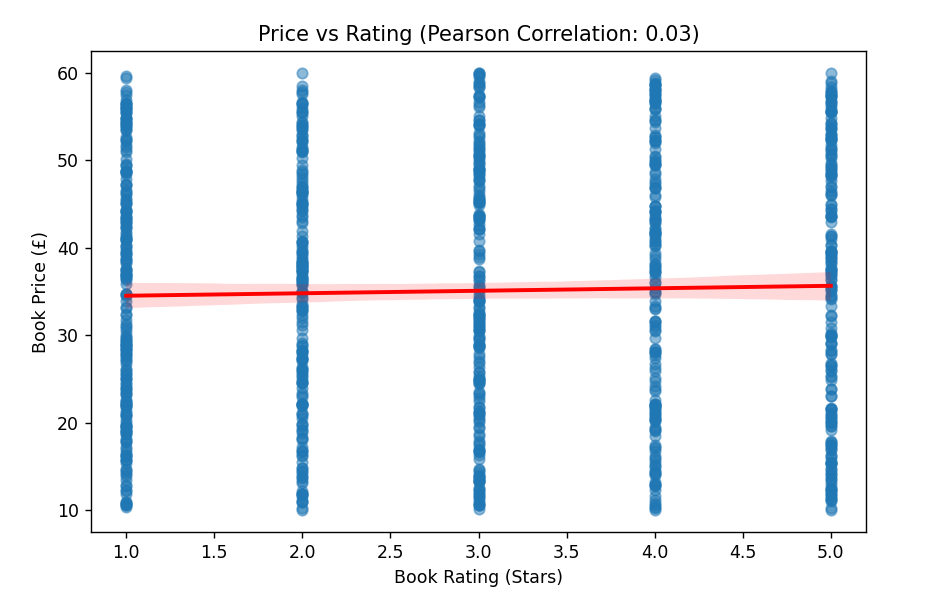
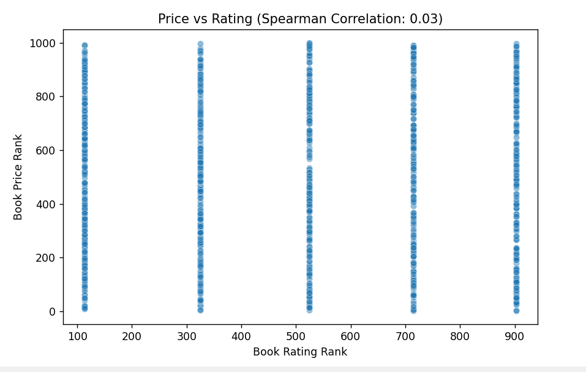
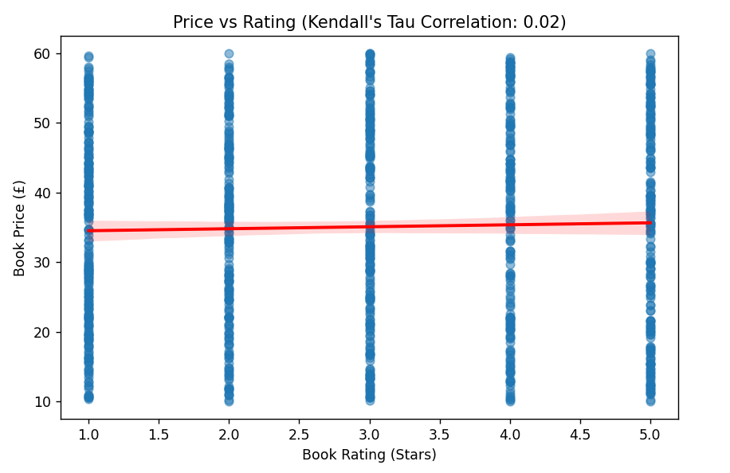
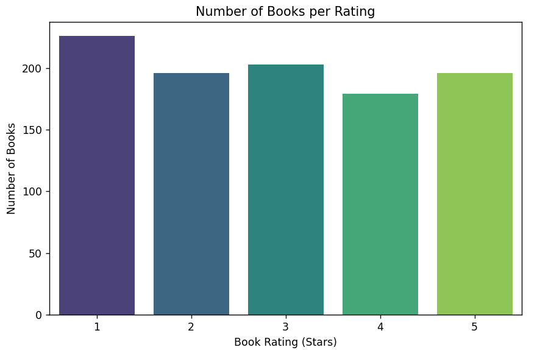
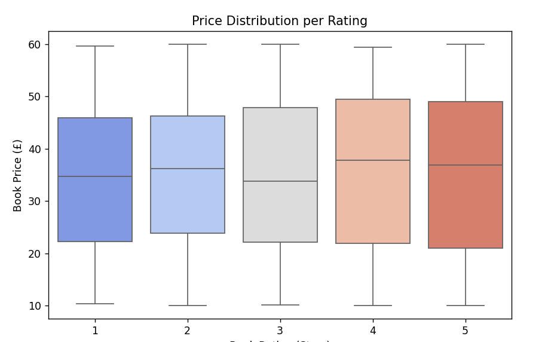

# Bookshop scapind and analysis challenge

## Overview:
The idea is to scrape all the 1000 books from [Books to scrape](https://books.toscrape.com/) by scraping the following elements:
- full title
- rating 
- price.  

Then store this data into a cvs file and understand if there is some correlation between the book price and its rating.

## Tech stack
- Python → Core language for the entire project.
- Scrapy → A Python framework used for web scraping.
- Pandas → For data manipulation, cleaning, and statistical analysis.
- Matplotlib → For general plotting & data visualization.
- Seaborn → For advanced visualizations with statistical insights.

# Part 1. Scraping
I implemented the scraping part using Scrapy framework for Python. Created a spider class called "books". 

To scrape the data, run the command :

```
scrapy crawl books
```

To store the result into a csv file ru:

```
scrapy crawl books -o books_raw.csv
```

In the scraping/books_raw.csv file in this repository I have the raw results of scraping in the format:

```
title,price,rating  
A Light in the Attic,£51.77,Three
...
```
I implemented the cleaning of the data separately for more flexibility with it, the cleaned data is stored in scraping/books_clean.csv in the format:
```
title,price,rating  
A Light in the Attic,51.77,3
...
```

# Part 2. Correlation analysis

## Linear correlation analysis
To understand whether book prices are influenced be their rating, I started with the linear analysis fo the data using Pearson correlation coefficient. This method measures the strength and direction of the relationship between two numeric variables - book price and rating.

By running the script in analysis/linear_corr.py we get such results:

```
Pearson Correlation: 0.03
```



The Pearson correlation between book rating and price is 0.03, which means a very weak positive correlation.
The points are evenly distributed across different rating levels, which further confirms that price is not strongly dependent on rating.

## Spearman Correlation Analysis
Since Pearson correlation only captures linear relationships, I also applied Spearman correlation to determine whether there is a monotonic relationship between book price and rating. Spearman measures whether as rating increases, price tends to increase or decrease consistently, even if the relationship is not perfectly linear.

By running the script in analysis/spearman_corr.py, we get:


After Spearman correlation analysis, we found that the correlation coefficient between book rating and price is 0.03, indicating an extremely weak monotonic relationship.

In fact, it confirms your initial Pearson correlation result—book price and rating are not related in a significant way.


## Kendall Tau Correlation Analysis

To continue with other classic analysis of relationship between numerical values I also implemented the Kendall Tau correlation analysis, which measures the strength of association between two ranked variables. Unlike Pearson and Spearman, Kendall Tau is particularly useful for small datasets with tied ranks and helps determine whether higher book ratings correspond to consistently higher or lower prices.

By running the script in analysis/kendall_tau.py, we get:


These results also are very similar to the previous analysis and dont show any meaningful dependebcy between book rating and book price.

## General analysis
Since by previous analysis I did nto find any particular correlation between rating and prices I also continuned and created the script for finding the general statistics of the dataset. 

By runnin analysis/general_analysis.py we get:
```
Total Books: 1000

Number of Books per Rating:
rating
1    226
2    196
3    203
4    179
5    196
Name: count, dtype: int64

Average Price: £35.07
Median Price: £35.98
Min Price: £10.00
Max Price: £59.99

Cheap vs Expensive Book Counts:
price_category
Expensive    500
Cheap        500
Name: count, dtype: int64

Average Price per Rating:
rating
1    34.561195
2    34.810918
3    34.692020
4    36.093296
5    35.374490
Name: price, dtype: float64

Most Expensive Books per Rating:
rating
1    59.64
2    59.95
3    59.99
4    59.45
5    59.92
Name: price, dtype: float64

Cheapest Books per Rating:
rating
1    10.40
2    10.02
3    10.16
4    10.01
5    10.00
Name: price, dtype: float64
```
Here we can see that among all the books the biggest amount is with rating 1 and the smallest amount are of books with rating 4.
- Average price is almost inbetween the lowest and the biggest price. 
- Average price per rating very slightly differs, which also confirms that all the prices of the books are evenly distributed among ratings. 
- Same we can see from the minimal and maximal price of the book in each category.

Here are also the visualizations:



# Summary
 All three correlation methods (Pearson: 0.03, Spearman: 0.03, Kendall Tau: ~0.02) confirm no meaningful relationship between price and rating.

This means that higher-rated books are not consistently priced higher or lower than lower-rated books.

The average book price (£35.07) is close to the median price (£35.98), suggesting that prices are evenly distributed.

The price range remains similar across all ratings, with both cheap and expensive books appearing at all rating levels.